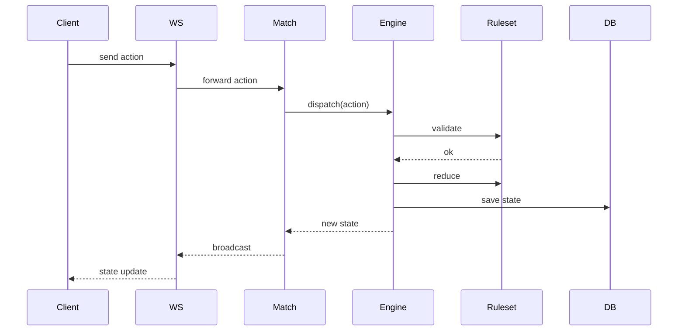

# Universal Game Engine

あらゆるボードゲームやカードゲームを統一されたインターフェースで動作させるための汎用ゲームエンジンプロジェクトです。

## 🎯 プロジェクトの目的

このプロジェクトは、ゲームのロジック（ルール）とエンジンの実行環境を分離し、新しいゲームを迅速かつ一貫した方法で実装・提供することを目的としています。
WebSockets を利用したマルチプレイヤー対応、状態の永続化、およびプレイヤーごとの情報隠匿（情報の非対称性）をサポートしています。

## ⚙️ ゲームエンジンの仕組み

### 状態管理 (Universal Engine)
エンジンは **Reducer パターン** を採用しています。
- プレイヤーからの全ての入力は `Action` として扱われます。
- エンジンは現在の `State` と `Action` を受け取り、ルールに基づいて新しい `State` を生成します。
- これにより、副作用のない予測可能な状態遷移と、アクション履歴によるリプレイ機能などが実現可能です。

### 隠匿情報の制御
`maskState` 機能により、特定のプレイヤーに送信すべきではない情報（相手の手札、山札の順序など）を動的にマスクできます。これにより、ポーカーや麻雀、UNO といった不完全情報ゲームにも対応しています。

## 📑 ルールセット (GameRuleset) システム

新しいゲームを追加するには、`GameRuleset` インターフェースを実装したクラスを作成するだけです。
エンジンは以下の責務をルールセットに委譲します：

- **バリデーション**: `isValidAction` による合法手チェック。
- **状態遷移**: `reduce` によるアクションの適用。
- **勝敗判定**: `checkWinCondition` によるゲーム終了と勝者の判定。
- **合法手生成**: `getLegalActions` による現在の状態で可能な手の一覧取得（AIやUI補助用）。

現在実装されているゲームは以下の通りです：

| カテゴリ | ゲーム名 | ステータス | 備考 |
| :--- | :--- | :--- | :--- |
| **ボードゲーム** | オセロ (2D/3D) | ✅ 実装済み |  |
| | 囲碁 | ✅ 実装済み | |
| | チェス / 将棋 | ✅ 実装済み | |
| | 三目並べ | ✅ 実装済み | エンジンの最小構成例として |
| **カードゲーム** | UNO | ✅ 実装済み | 特殊カード・ドロースタック対応 |
| | 大富豪 | ✅ 実装済み | |
| | テキサスホールデム | ✅ 実装済み | 隠匿情報のマスク処理に対応 |
| | 麻雀 | ✅ 実装済み | 役判定ロジックを含む |
| | ハイアンドロー | ✅ 実装済み | シンプルな対戦例として |
| **パズル・その他** | ルービックキューブ | ⚠️ 一部実装 | 回転ロジックのみ |

---

## 🤖 AI プレイヤーの実装


このプロジェクトでは、統一されたインターフェースを通じて AI プレイヤーを簡単に統合できます。

### IAIPlayer インターフェース
全ての AI は `IAIPlayer` インターフェースを実装します。
- **`computeNextMove`**: 現在の状態と合法手のリストを受け取り、次の一手を決定します。非同期 (Promise) として定義されているため、深層学習や複雑な探索アルゴリズム（MCTS, MiniMax 等）にも対応可能です。

### 合法手の提供
AI はルールセットが提供する `getLegalActions` を利用することで、自らルールを解釈することなく、その瞬間に可能な全ての手を知ることができます。これにより、新しいゲームを追加した際に、既存の汎用 AI アルゴリズムを即座に適用することが容易になっています。

### 実装例
- **`RandomPlayer`**: 合法手の中からランダムに選択する、最もシンプルな AI 実装です。

## 🏗️ モノレポ構成

このプロジェクトは `apps` と `packages` に分かれたモノレポ構成です。

- **`apps/frontend`**: Vue 3 + Vite + TypeScript によるゲームクライアント。Three.js を利用した 3D 表示もサポート。
- **`apps/backend`**: Bun + WebSockets (Socket.io) によるゲームサーバー。
- **`packages/shared`**: エンジン本体、および各ゲームのルールセット定義。フロントエンド・バックエンド両方で共有されます。

## 🚀 セットアップと実行

### プリレクイジット
- [Bun](https://bun.sh/) (v1.3.10 以上を推奨)

### インストール
ルートディレクトリで以下を実行してください：

```bash
bun install
```

### 実行方法
フロントエンドとバックエンドを同時に起動するには：

```bash
# ルートディレクトリにて
bun run dev
```

個別での起動：
- **Backend**: `cd apps/backend && bun dev`
- **Frontend**: `cd apps/frontend && bun dev`

## 📐 アーキテクチャ図（データフロー）

