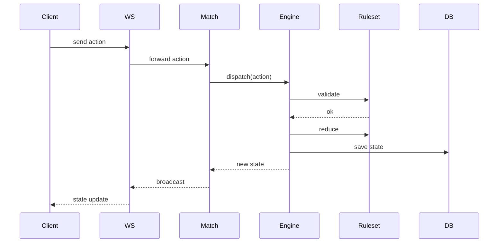

# 🎲 Universal Game Engine

あらゆるボードゲーム、カードゲーム、パズルを統一されたインターフェースで動作させるための汎用ゲームエンジンプロジェクトです。

ゲームのロジック（ルール）とエンジンの実行環境を分離することで、新しいゲームを迅速かつ一貫した方法で実装・提供できるように設計されています。

## ✨ 主な特徴

- **Reducerパターンによる状態管理**: 副作用のない予測可能な状態遷移。Undo/Redoやリプレイの実装が容易です。
- **隠匿情報の動的制御**: `maskState` 機能により、ポーカーや麻雀などの不完全情報ゲームにおける「情報の非対称性」をサポート。
- **マルチプレイヤー対応**: WebSockets (Socket.io) を利用したリアルタイム通信。
- **シームレスなAI統合**: 統一された `IAIPlayer` インターフェースにより、ランダムAIから深層学習ベースのAIまで容易に組み込み可能。

---

## 🚀 セットアップと実行

### 前提条件
- [Bun](https://bun.sh/) (v1.3.10 以上を推奨)

### インストール
ルートディレクトリで以下を実行して依存関係をインストールします：

```bash
bun install
```

### 起動方法

フロントエンドとバックエンドを同時に起動するには、ルートディレクトリで以下のコマンドを実行します：

```bash
bun run dev
```

> **個別起動の場合:**
> * Backend: `cd apps/backend && bun dev`
> * Frontend: `cd apps/frontend && bun dev`
> 
> 

---

## 🏗️ モノレポ構成

本プロジェクトは機能ごとに分割されたモノレポ構成を採用しています。

* **`apps/frontend`**: Vue 3 + Vite + TypeScript によるゲームクライアント。Three.jsを利用した3D表示もサポート。
* **`apps/backend`**: Bun + WebSockets によるゲームサーバー。
* **`packages/shared`**: エンジン本体および各ゲームのルールセット定義。フロントエンド・バックエンド間で共有されます。

---

## 🎮 対応ゲーム一覧 (GameRuleset)

新しいゲームを追加するには、`GameRuleset` インターフェースを実装したクラスを作成するだけです。エンジンは、バリデーション、状態遷移、勝敗判定などの責務を各ルールセットに委譲します。

| カテゴリ | ゲーム名 | ステータス | 備考 |
| --- | --- | --- | --- |
| **ボードゲーム** | オセロ (2D/3D) | ✅ 実装済み |  |
|  | 囲碁 | ✅ 実装済み |  |
|  | チェス / 将棋 | ✅ 実装済み |  |
|  | 三目並べ | ✅ 実装済み | エンジンの最小構成例として最適 |
| **カードゲーム** | UNO | ✅ 実装済み | 特殊カード・ドロースタック対応 |
|  | 大富豪 | ✅ 実装済み |  |
|  | テキサスホールデム | ✅ 実装済み | 隠匿情報の動的マスク処理に対応 |
|  | 麻雀 | ✅ 実装済み | 複雑な役判定ロジックを含む |
|  | ハイアンドロー | ✅ 実装済み | シンプルな対戦例として |
| **パズル** | ルービックキューブ | ⚠️ 一部実装 | 現在は回転ロジックのみ |

---

## 📐 アーキテクチャ

### データフロー

プレイヤーのアクションがどのように処理され、状態が更新されるかのシーケンスです。



---

## 🤖 AIプレイヤーの統合

すべてのAIは `IAIPlayer` インターフェースを実装します。

* **非同期対応**: `computeNextMove` メソッドは Promise を返すため、MCTS（モンテカルロ木探索）や Minimax などの複雑な探索アルゴリズムにも対応します。
* **合法手の自動取得**: AIはルールセットから提供される `getLegalActions` を利用し、その瞬間に実行可能な全アクションを即座に把握できます。ルールを自ら解釈する必要はありません。

---

## 🧠 状態遷移の数学的モデル (Architecture Philosophy)

本エンジンは、ゲームの進行を数学的な「状態遷移関数」として厳密に捉える思想に基づいています。これにより、高度な分析やAIの最適化が可能になります。

### 1. 状態遷移の形式化

ゲームのルール遂行は、状態空間 $S$ とアクション空間 $A$ を用いて、次のような決定論的な状態遷移関数 $T$ として定義されます。

$$T: S \times A \rightarrow S \cup \{\text{Invalid}\}$$

乱数要素も状態 $S$ にシードとして含めることで、純粋関数としての性質を維持します。

### 2. 関数化による利点

* **履歴管理と逆関数**: 状態がイミュータブルであるため、アクションの履歴をたどることで任意の時点の再現や、逆関数的な操作（Undo）が容易です。

$$\text{Revert}(S_{\text{next}}, A) \rightarrow S_{\text{current}}$$


* **グラフ理論による探索**: 状態をノード、アクションをエッジとする有向グラフとしてゲームを捉えることで、到達可能性分析や最短経路問題（AIの探索）に適用できます。
* **複雑性の定量化**: 状態空間の大きさ $|S|$ や、合法手の平均分岐数（Average Branching Factor）を計算し、AIの計算資源計画に役立てます。

$$\text{Average Branching Factor} = E_S [|A_{\text{legal}}(S)|]$$


### 3. 一人用パズルへの適用

対戦ゲームだけでなく、数独やルービックキューブのような一人用ゲームも、初期状態から終了（解決）状態への「最短経路探索問題」として同様の関数モデルで解釈・解決することが可能です。

