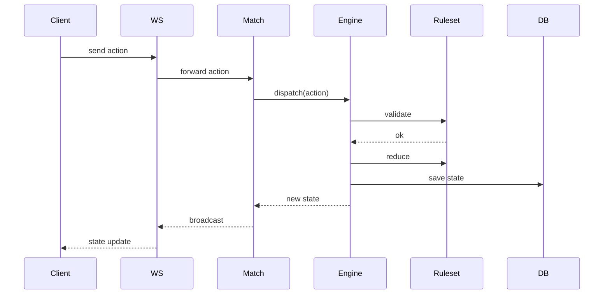

# 🎲 Universal Game Engine

あらゆるボードゲーム、カードゲーム、パズルを統一されたインターフェースで動作させるための汎用ゲームエンジンプロジェクトです。

ゲームのロジック（ルール）とエンジンの実行環境を分離することで、新しいゲームを迅速かつ一貫した方法で実装・提供できるように設計されています。

## ✨ 主な特徴

- **Reducerパターンによる状態管理**: 副作用のない予測可能な状態遷移。Undo/Redoやリプレイの実装が容易です。
- **隠匿情報の動的制御 (`Secret<T>`)**: 不完全情報ゲームにおける情報の非対称性を宣言的に定義可能。
- **マルチプロトコル通信**: WebSockets (Socket.io) に加え、高パフォーマンスな **gRPC** および REST API をサポート。
- **ネットワーク最適化**: **State Delta (JSON Patch)** による差分更新伝送により、通信帯域を最小限に抑制。
- **シームレスなAI統合**: 統一された `IAIPlayer` インターフェースにより、ランダム、**Minimax (Alpha-Beta)**、**MCTS (モンテカルロ木探索)** などのAIをプラグイン可能。
- **AIテンソル変換 (`AITensorAdapter`)**: ゲーム状態を機械学習に最適なテンソル形式へ自動変換する仕組みを標準装備。

---

## 🚀 セットアップと実行

### 前提条件

- [Bun](https://bun.sh/) (v1.3.10 以上を推奨)
- [Go Task](https://taskfile.dev/) (推奨コマンドランナー)

### インストール

ルートディレクトリで以下を実行して依存関係をインストールします：

```bash
bun install
```

### 起動方法

フロントエンドとバックエンドを同時に起動するには、ルートディレクトリで以下のコマンドを実行します：

```bash
bun run dev  # または task dev
```

> **個別起動の場合:**
>
> - Backend: `cd apps/backend && bun dev`
> - Frontend: `cd apps/frontend && bun dev`

---

## 🏗️ モノレポ構成

本プロジェクトは機能ごとに分割されたモノレポ構成を採用しています。

- **[`apps/frontend`](./apps/frontend/README.md)**: Vue 3 + Vite + TypeScript。Three.jsを利用した3D表示をサポート。ブラウザ版に加え、**Electron** によるデスクトップアプリも提供。
- **[`apps/backend`](./apps/backend/README.md)**: Bunベース。Socket.io、gRPC (Node gRPC JS) の両方を搭載。
- **[`packages/shared`](./packages/shared/README.md)**: コアエンジン、AIプレイヤー、および各ゲームのルールセット定義。

---

## 🎮 対応ゲーム一覧 (GameRuleset)

| カテゴリ           | ゲーム名           | ステータス  | 備考                             |
| ------------------ | ------------------ | ----------- | -------------------------------- |
| **ボードゲーム**   | オセロ (2D/3D)     | ✅ 実装済み |                                  |
|                    | 将棋 (2D/3D)       | ✅ 実装済み | 持ち駒、成りの3D表現に対応       |
|                    | チェス (2D/3D)     | ✅ 実装済み |                                  |
|                    | 囲碁               | ✅ 実装済み |                                  |
|                    | 三目並べ           | ✅ 実装済み |                                  |
|                    | マンカラ           | ✅ 実装済み |                                  |
|                    | Equilibrium        | ✅ 実装済み | 独自の幾何学的戦略ゲーム         |
| **カードゲーム**   | UNO                | ✅ 実装済み |                                  |
|                    | 大富豪             | ✅ 実装済み |                                  |
|                    | テキサスホールデム | ✅ 実装済み | ベッティング・隠匿情報処理に対応 |
|                    | スピード           | ✅ 実装済み | リアルタイムアクション系         |
|                    | 花札 (こいこい)    | ✅ 実装済み |                                  |
|                    | ハイアンドロー     | ✅ 実装済み |                                  |
|                    | ポケモンTCG        | ✅ 実装済み | 複雑な効果処理スタックを実装     |
| **パズル・その他** | ルービックキューブ | ✅ 実装済み | 3Dインタラクティブ操作に対応     |
|                    | 数独               | ✅ 実装済み |                                  |
|                    | Wordle             | ✅ 実装済み |                                  |
|                    | 麻雀               | ✅ 実装済み |                                  |

---

## 📐 アーキテクチャ

### データフロー

プレイヤーのアクションがどのように処理され、状態が更新されるかのシーケンスです。



---

### プレゼンテーション層の分離 (Renderer-Agnostic)

フロントエンドは特定のレンダリングライブラリに依存しません。

- **Three.js**: `Shogi3D.vue`, `RubicCube.vue`, `Othello3D.vue` 等、空間認識やリッチな表現が必要なゲームで使用。
- **DOM/CSS**: `TicTacToe.vue`, `Uno.vue` 等、軽量でアクセシビリティが重要なゲームで使用。
- **拡張性**: 将来的に Unity (WebGL) や Babylon.js への移行もコアロジックを崩さずに行えます。

---

### AIプレイヤーの階層

1. **`IAIPlayer`**: 非同期意思決定を行う基本インターフェース。
2. **`RandomPlayer`**: 合法手の中からランダムに選択するベースラインAI。
3. **`MinimaxPlayer`**: Alpha-Beta枝刈りを備えた固定深度探索AI。
4. **`MCTSPlayer`**: UCTアルゴリズムを用いたモンテカルロ木探索AI。

---

## 🧠 状態遷移の数学的モデル (Architecture Philosophy)

本エンジンは、ゲームの進行を数学的な「状態遷移関数」として厳密に捉える思想に基づいています。これにより、高度な分析やAIの最適化が可能になります。

### 1. 状態遷移の形式化

ゲームのルール遂行は、状態空間 $S$ とアクション空間 $A$ を用いて、次のような決定論的な状態遷移関数 $T$ として定義されます。

$$T: S \times A \rightarrow S \cup \{\text{Invalid}\}$$

乱数要素も状態 $S$ にシードとして含めることで、純粋関数としての性質を維持します。

### 2. 関数化による利点

- **履歴管理と逆関数**: 状態がイミュータブルであるため、アクションの履歴をたどることで任意の時点の再現や、逆関数的な操作（Undo）が容易です。

$$\text{Revert}(S_{\text{next}}, A) \rightarrow S_{\text{current}}$$

- **グラフ理論による探索**: 状態をノード、アクションをエッジとする有向グラフとしてゲームを捉えることで、到達可能性分析や最短経路問題（AIの探索）に適用できます。
- **複雑性の定量化**: 状態空間の大きさ $|S|$ や、合法手の平均分岐数（Average Branching Factor）を計算し、AIの計算資源計画に役立てます。

$$\text{Average Branching Factor} = E_S [|A_{\text{legal}}(S)|]$$

### 3. 一人用パズルへの適用

対戦ゲームだけでなく、数独やルービックキューブのような一人用ゲームも、初期状態から終了（解決）状態への「最短経路探索問題」として同様の関数モデルで解釈・解決することが可能です。
