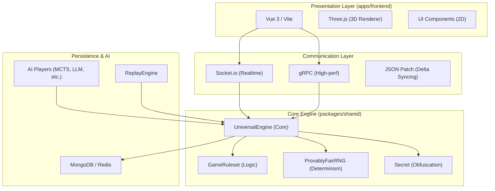
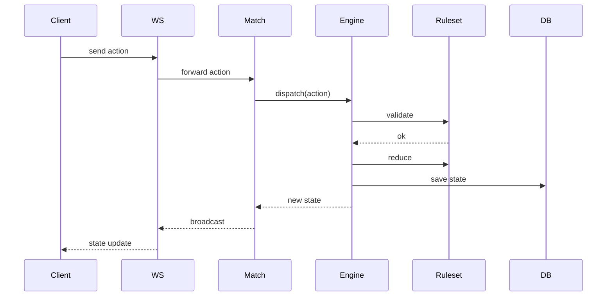

# 🎲 Universal Game Engine

あらゆるボードゲーム、カードゲーム、パズルを統一されたインターフェースで動作させるための汎用ゲームエンジンプロジェクトです。

ゲームのロジック（ルール）とエンジンの実行環境を分離することで、新しいゲームを迅速かつ一貫した方法で実装・提供できるように設計されています。

## ✨ 主な特徴

- **Reducerパターンによる状態管理**: 副作用のない予測可能な状態遷移。Undo/Redoやリプレイの実装が容易です。
- **隠匿情報の動的制御 (`Secret<T>`)**: 不完全情報ゲームにおける情報の非対称性を宣言的に定義可能。
- **マルチプロトコル通信**: WebSockets (Socket.io) に加え、高パフォーマンスな **gRPC** および REST API をサポート。
- **ネットワーク最適化**: **State Delta (JSON Patch)** による差分更新伝送により、通信帯域を最小限に抑制。
- **シームレスなAI統合**: 統一された `IAIPlayer` インターフェースにより、ランダム、**Minimax (Alpha-Beta)**、**MCTS (モンテカルロ木探索)** などのAIをプラグイン可能。
- **AIテンソル変換 (`AITensorAdapter`)**: ゲーム状態を機械学習に最適なテンソル形式へ自動変換する仕組みを標準装備。

---

## 🚀 セットアップと実行

### 前提条件

- [Bun](https://bun.sh/) (v1.3.10 以上を推奨)
- [Go Task](https://taskfile.dev/) (推奨コマンドランナー)

### インストール

ルートディレクトリで以下を実行して依存関係をインストールします：

```bash
bun install
```

### 起動方法

フロントエンドとバックエンドを同時に起動するには、ルートディレクトリで以下のコマンドを実行します：

```bash
bun run dev  # または task dev
```

> **個別起動の場合:**
>
> - Backend: `cd apps/backend && bun dev`
> - Frontend: `cd apps/frontend && bun dev`

---

## 🏗️ モノレポ構成

本プロジェクトは機能ごとに分割されたモノレポ構成を採用しています。

- **[`apps/frontend`](./apps/frontend/README.md)**: Vue 3 + Vite + TypeScript。Three.jsを利用した3D表示をサポート。ブラウザ版に加え、**Electron** によるデスクトップアプリも提供。
- **[`apps/backend`](./apps/backend/README.md)**: Bunベース。Socket.io、gRPC (Node gRPC JS) の両方を搭載。
- **[`packages/shared`](./packages/shared/README.md)**: コアエンジン、AIプレイヤー、および各ゲームのルールセット定義。

---

## 🎮 対応ゲーム一覧 (GameRuleset)

| カテゴリ           | ゲーム名           | ステータス  | 備考                             |
| ------------------ | ------------------ | ----------- | -------------------------------- |
| **ボードゲーム**   | オセロ (2D/3D)     | ✅ 実装済み |                                  |
|                    | 将棋 (2D/3D)       | ✅ 実装済み | 持ち駒、成りの3D表現に対応       |
|                    | チェス (2D/3D)     | ✅ 実装済み |                                  |
|                    | 囲碁               | ✅ 実装済み |                                  |
|                    | 三目並べ           | ✅ 実装済み |                                  |
|                    | マンカラ           | ✅ 実装済み |                                  |
|                    | Equilibrium        | ✅ 実装済み | 独自の幾何学的戦略ゲーム         |
| **カードゲーム**   | UNO                | ✅ 実装済み |                                  |
|                    | 大富豪             | ✅ 実装済み |                                  |
|                    | テキサスホールデム | ✅ 実装済み | ベッティング・隠匿情報処理に対応 |
|                    | スピード           | ✅ 実装済み | リアルタイムアクション系         |
|                    | 花札 (こいこい)    | ✅ 実装済み |                                  |
|                    | ハイアンドロー     | ✅ 実装済み |                                  |
|                    | ポケモンTCG        | ✅ 実装済み | 複雑な効果処理スタックを実装     |
| **パズル・その他** | ルービックキューブ | ✅ 実装済み | 3Dインタラクティブ操作に対応     |
|                    | 数独               | ✅ 実装済み |                                  |
|                    | Wordle             | ✅ 実装済み |                                  |
|                    | 麻雀               | ✅ 実装済み |                                  |

---

## 🏗️ アーキテクチャ概要 (Architecture Overview)

本プロジェクトは、堅牢性、再現性、および拡張性を最優先した多層アーキテクチャを採用しています。

### 1. 全体構造



### 2. データフロー (Data Flow)

プレイヤーのアクションがどのように処理され、状態が更新されるかのシーケンスです。



### 3. コア・エンジン設計思想

#### Reducerパターンとイミュータビリティ

エンジンの状態遷移は、Reduxにインスパイアされた **Reducerパターン** に基づいています。

- **純粋関数**: `reduce(state, action) -> newState` は副作用を持たず、現在の状態とアクションのみから次の状態を決定します。
- **完全なイミュータビリティ**: 開発環境では `deepFreeze` を用いて状態の破壊的変更を禁止し、予期せぬバグを未然に防ぎます。

#### 検証可能な決定論 (Provably Fair Determinism)

`IGameRNG` インターフェースを通じて、**決定論的な乱数生成** を行います。

- **再現性**: 初期シードとアクションログがあれば、誰でも同じゲーム展開を1ビットの狂いなく再現可能です。
- **Provably Fair**: `serverSeed`（秘密）と `clientSeed`（公開）を組み合わせたハッシュ化により、運営側による不正操作が不可能な公平性を担保します。

### 4. 情報制御の自動化 (`Secret<T>`)

不完全情報ゲーム（麻雀、ポーカー等）における情報の非対称性を、型レベルで安全に扱います。

- **宣言的な秘匿**: 状態定義内で `Secret<T>` 型を使用することで、「誰にどの情報を見せるか」を定義。
- **自動マスク処理**: `getMaskedState(playerId)` を呼び出すだけで、エンジンが再帰的に状態を走査し、権限のない情報を自動的に伏せ字（`"?"`等）に変換してクライアントへ送信します。

### 5. プレゼンテーション層の分離 (Renderer-Agnostic)

フロントエンドは特定のレンダリングライブラリに依存しません。

- **Three.js**: `Shogi3D.vue`, `RubicCube.vue`, `Othello3D.vue` 等、空間認識やリッチな表現が必要なゲームで使用。
- **DOM/CSS**: `TicTacToe.vue`, `Uno.vue` 等、軽量でアクセシビリティが重要なゲームで使用。
- **拡張性**: 将来的に Unity (WebGL) や Babylon.js への移行もコアロジックを崩さずに行えます。

### 6. AI エコシステム

共通の `IAIPlayer` インターフェースにより、多種多様な意思決定アルゴリズムをシームレスに統合。

- **探索ベース**: Minimax (Alpha-Beta pruning), MCTS (UCT Algorithm)。
- **LLMベース**: `LLMPlayer` による自然言語対話型・推論型AI。
- **非同期実行**: 重い計算を伴うAIは Web Workers や外部サーバーで実行され、エンジン本体のリアルタイム性を損ないません。

### 7. 通信・スケーラビリティ

- **State Delta (JSON Patch)**: 状態全体ではなく、変更箇所のみを送信することで通信帯域を劇的に削減。
- **プロトコル・アグノスティック**: `INetworkClient` 抽象化により、WebSocket (低遅延重視) と gRPC (型安全・高スループット重視) を透過的に切り替え可能。
- **ステートレス設計**: エンジン状態は MongoDB/Redis に永続化され、サーバーを跨いだスケーリングが容易です。

---

## 🧠 状態遷移の数学的モデル (Formal Model)

本エンジンは、ゲームの進行を数学的な「状態遷移関数」として厳密に定義しています。

### 1. 状態遷移の形式化

ゲームのルール遂行は、状態空間 $S$ とアクション空間 $A$ を用いて、決定論的な状態遷移関数 $T$ として定義されます。

$$T: S \times A \rightarrow S \cup \{\text{Invalid}\}$$

乱数シード $\sigma$ を含めることで、非線形な遷移も純粋関数として維持されます。

### 2. 分析と応用

- **履歴の完全再現**: 任意の $t$ における状態 $S_t$ は、初期状態 $S_0$ とアクション系列 $A_{1..t}$ の合成により一意に定まります。
- **到達空間分析**: 状態をノード、アクションをエッジとする有向グラフとしてゲームを捉え、AIの最短経路探索や動的計画法に適用します。
- **平均分岐数 (Branching Factor)**: $E_S [|A_{\text{legal}}(S)|]$ を算出することで、ゲームの複雑性とAIに必要な計算リソースを定量化します。
